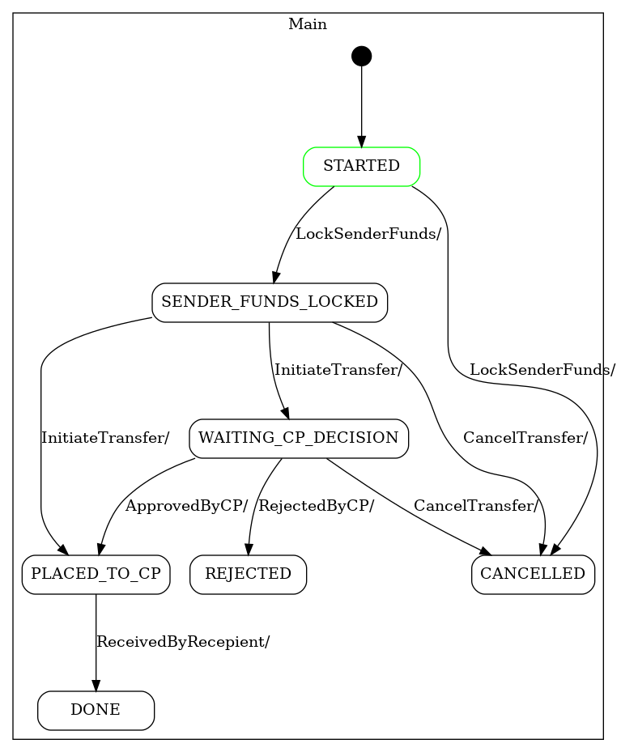
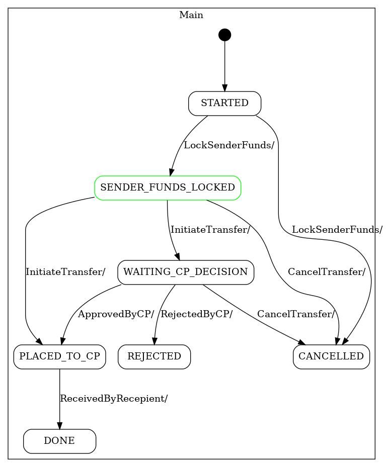
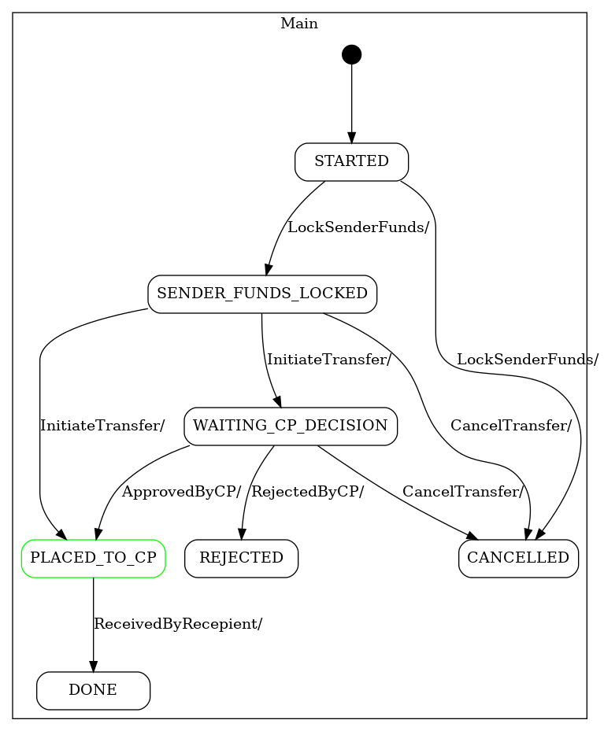
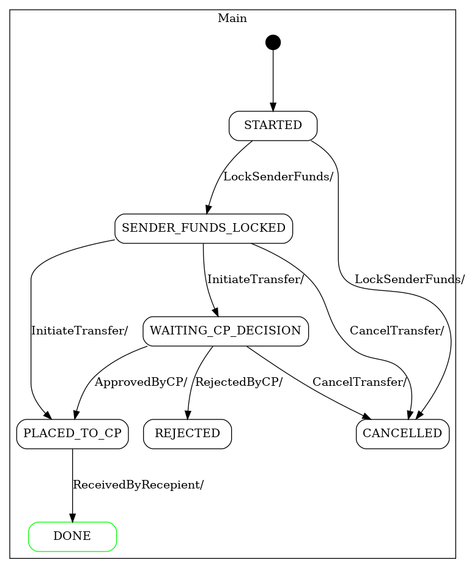

testing SMC
---

    ./build.sh

then we can look at generated code and state machine diagrams

target/generated-sources/smc/com/xpansiv/demo/fsm/asset_transfer/TransferAssets_sm.dot

target/generated-sources/smc/com/xpansiv/demo/fsm/asset_transfer/TransferAssets_sm.dot.png

Also test shows how dot file can be used to dynamically highlight current state of machine

